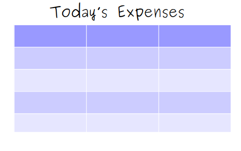
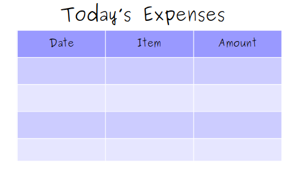
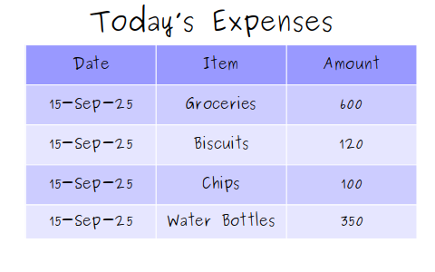

## Relational Model
Relational Model is a design paradigm used for database design which treats the contents of a databases as a set of relations, each of which is a tabular structure that stores a set of records (each representing a particular instance of the relation), with each record having a same set of fields (each representing some attribute of the relation)

This particular model was introduced by E.F.Codd back in 1970 and became the basis of the commonly-used relational DBMS and SQL query language implementation.

As an example, assume that you have done a lot of expenditures for the day and want to keep track of your expenses. There can be multiple ways to document this, but one maintainable way that you think of is to create a criss-cross table to note down your entries. You draw something like the following:

Now, the first step you need to perform is to think of what kind of information you want to write for your expense tracking. In other words, you need to think of the fields or attributes of the data that you will be describing. For this basic example, you take the following three attributes into account:

 - Date 
 - Item
 - Amount

In terms of Relational Model, these are your fields, names that represent what your data stands for. These will suffice for your basic expense note-taking for now. The table you had drawn now looks something like this:

Now that you have in mind how you want to describe your data, you can start filling up the table with your entries. Each of these entries will be mapped to each of the defined fields. Whether each of these fields will be populated for each record is another thing though, which we will discuss later. So for now, you remebered that you bought some gorcery items and snacks. You might write them down in the file as follows:

In terms of Relational Model, these are your records, each entry being some instance containing values against the defined fields. Now, this was a very simplified example where we discussed three fundamental concepts related to Relational Model. Expanding on this example, now assume the scenario of a financial institution like a Bank, where instead of just your personal expenses, every transaction is being recorded against all of the customers registered with the Bank, including the Bank itself. Transactional data like this serves as the foundation for Banking systems and is a good example of dataset where different RDBMS related concepts can be applied effectively. There can be thousands of different attributes on which the data can be analyzed e.g. deposits and loans have a completely different set of attributes on which decisions can be made. Similarly, since there are usually millions of customers associated with such an organization, the records will be huge as well. Going forward, we will be using finance related use cases to study over RDBMS systems. 