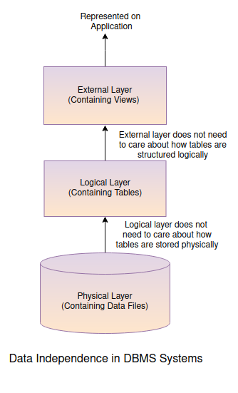

## Data Independence
As discussed, a relational model is an abstraction over the actual set of files to easily handle the storage and management of data associated with a database. This easiness in maintainability comes due to the implementation of data independence provided by the DBMS. Consider the following illustration to understand this data independency:

As visible from the illustration, we can segregate implementation of DBMS systems into three layers as per the concept of data independence:

- __Physical Layer:__ The physical layer is the place where all data files are stored physically (whether it be on disk or memory). This layer is concerned with how read/write operations are done on disk, how are pages and extents managed and how buffer is stored. Sometimes, this layer is also referred to as the "Backend of DBMS systems" as all of the internal working that takes place under the hood, when you perform some CRUD operation, happens at this layer. Usually DBA Admins are assigned the role to overlook this layer.

- __Logical Layer:__ The logical layer is where the relational model abstraction lies. This layer is also referred to as a database schema. The schema comprises a set of different database objects such as tables, indexes, etc. which can be created and manipulated via a query language. How is the data within the table actually stored is abstracted away, allowing the relevant user to perform CRUD operations with easy without ever worrying about how everything is being managed physically. This part of data independence layer is overseen by database developers and engineers that create data models, manage data transformations and are responsible for query related operations.

- __External Layer:__ The external layer is not something that is separate from the logical layer in terms of implementation as it also comes under the defined schema. Rather, this layer exists in terms of data independence where an external view is created over the set of defined tables within the schema for a specific use case. For example, if the deployed application using the database wants the user to only see the transaction amounts and description, we can create a view over the actual transactions table and exclude all the irrelevant information from it, so it can be displayed accordingly by the application. This results in a data independence layer where the view is not concerned with what other kind of data or fields are present in the table. 

This segregation of data independence is one of the main features of the database, due to which it becomes easy to manage data and perform relevant operations, as the operator at each layer does not need to worry what is happening under the hood.